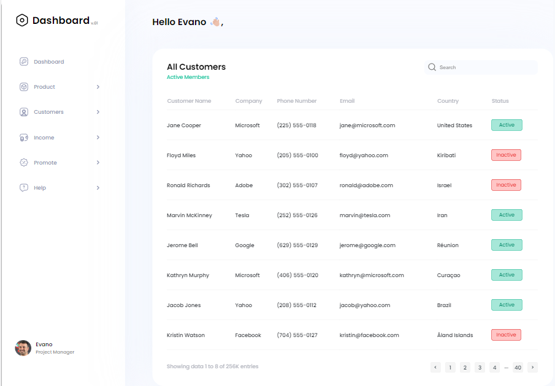
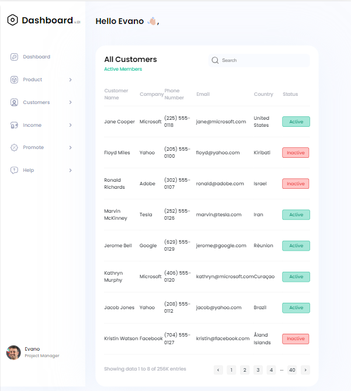
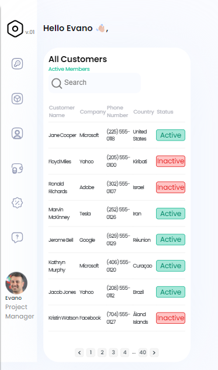

# Dashboard

[Live Page]()

## Project description

Welcome to "Dashboard" repository that contains source code and
assets for this website!

## 🔍 Accessibility

- Intuitive design
- Semantic HTML
- Mobile-Friendly
- The web resource is available for any device with an Internet connection

## 🌐 Supported Languages

- English

## 🚀 Getting Started

1. Clone the repository: `https://github.com/tanightt/test_customers.git`
2. Navigate to the project directory: `cd test_customers`
3. Use the project on: `http://localhost:5500`
